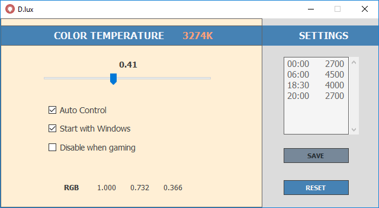

# D.lux
Prevents eye fatigue by reducing the amount of blue light your monitor emits.

# 

#### Download
* [Download D.lux from here](https://github.com/D-Ermis/D.lux/releases)

#### Screenshot

#### Features
* [Fast] Smooth gradual transitions. D.lux doesn't slow down your computer
* [Simple] D.lux doesn't depend on geolocation but instead is based on the time of day
* [Secure] Administrator rights not needed unless you want to go below 3400K (Windows limitation)
* Gamer mode feature (disables D.lux when a game is running)

#### License
Copyright 2017 Dogukan Ermis

**D.lux**

This Source Code Form is subject to the terms of the 
Mozilla Public License, v. 3.0. If a copy of the MPL 
was not distributed with this file, You can obtain one at 
http://mozilla.org/MPL/3.0/

D.lux is inspired by f.lux, redshift and blux.
